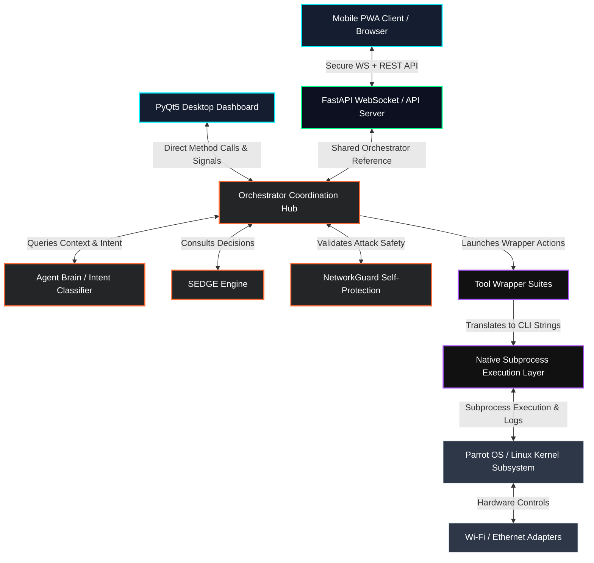

# 🏗️ System Architecture Guide — JAMES Linux

This document details the high-level architecture, layer responsibilities, execution flows, and system integration within **JAMES Linux**.

---

## 🧱 Component Layering Diagram

The following diagram illustrates how the frontend controllers, background servers, core orchestrator, tool abstractions, and OS subsystem interact:

---

## 🛡️ The System Layers

### 1. The Presentation Layer
JAMES provides two presentation formats that synchronize state in real time:
*   **Desktop App (`james/gui/`)**: A native Python application built using **PyQt5**. It provides dashboard widgets, terminal monitors, loot tables, and a real-time conversational chat client. It offloads heavy pentesting operations to thread pools using `QThread` and custom `Worker` objects (`james/gui/utils/worker.py`) to prevent GUI freezing.
*   **Web Console / PWA Client**: Primary modern client is the React + Vite app in `web/` (TypeScript, Tailwind). Legacy lightweight SPA remains in `james/web/` (vanilla JS PWA). Both talk to the FastAPI server. Prefer `web/` for new development.

### 2. The Server & API Layer (`james/ser
