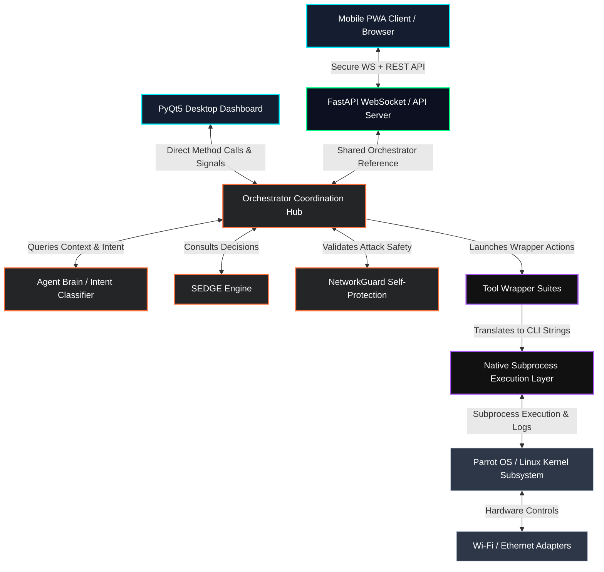

# 🏗️ System Architecture Guide — JAMES Linux

This document details the high-level architecture, layer responsibilities, execution flows, and system integration within **JAMES Linux**.

---

## 🧱 Component Layering Diagram

The following diagram illustrates how the frontend controllers, background servers, core orchestrator, tool abstractions, and OS subsystem interact:



---

## 🛡️ The System Layers

### 1. The Presentation Layer
JAMES provides two presentation formats that synchronize state in real time:
*   **Desktop App (`james/gui/`)**: A native Python application built using **PyQt5**. It provides dashboard widgets, terminal monitors, loot tables, and a real-time conversational chat client. It offloads heavy pentesting operations to thread pools using `QThread` and custom `Worker` objects (`james/gui/utils/worker.py`) to prevent GUI freezing.
*   **Web Console / PWA Client**: Primary modern client is the React + Vite app in `web/` (TypeScript, Tailwind). Legacy lightweight SPA remains in `james/web/` (vanilla JS PWA). Both talk to the FastAPI server. Prefer `web/` for new development.

### 2. The Server & API Layer (`james/server/` & `james/api/`)
*   **FastAPI & Uvicorn**: Hosts the backend web server on port `8745` (or `8443` with custom HTTPS setup). It uses a JWT-based login schema to secure remote connections.
*   **WebSockets**: Streams command stdout, task updates, suggestion chips, and system status logs directly to all connected web clients in real time.

### 3. The Core Coordination Layer (`james/core/`)
*   **The Orchestrator (`orchestrator.py`)**: The central routing system. All GUI threads and FastAPI server requests call orchestrator methods. It coordinates the tool wrappers, loads configuration scripts (skills), manages the active state context, handles sudo credentials, and updates the task history.
*   **The Agent Brain (`agent.py` & `ai_engine.py`)**: Responsible for understanding and mapping inputs (regex intents or LLM-based function calling), resolving pronouns relative to session history (e.g. "it" -> `192.168.1.1`), and organizing long-running autonomous chains.
*   **SEDGE (`sedge.py`)**: The Self-Evolving Decision Graph Engine. Rather than using static chains, SEDGE uses stochastic reinforcement learning graphs to dynamically choose actions based on prior successes.
*   **NetworkGuard (`net_guard.py`)**: A safety firewall that polls local routing tables (`nmcli`/`ip route`). It blocks operations that would deauthenticate the host's connected AP, put the active network card in monitor mode, or terminate NetworkManager.

### 4. The Execution & Abstraction Layer (`james/layers/` & `james/tools/`)
*   **Native Subprocess Execution Layer (`native.py`)**: Handles the raw spawning of Linux binaries. It intercepts output line-by-line, decodes stream buffers (supporting Latin-1 and UTF-8 fallbacks), runs background processes, registers PIDs for cleanup, and injects cached sudo passwords securely.
*   **Tool Wrappers (`parrot.py` & `pineap.py`)**: Contain structured classes wrapping individual pentesting binaries (e.g. `nmap`, `aircrack-ng`, `hashcat`, `sqlmap`, `responder`). They translate Python dictionaries of parameters into standard CLI commands and parse console text outputs into machine-readable JSON.

---

## 🚦 Operational Modes

You can launch JAMES in multiple configurations via `main.py` command line flags:

```
┌─────────────────┐      ┌─────────────────────────────┐      ┌───────────────────────────────┐
│     DEFAULT     │      │          --server           │      │            --both             │
├─────────────────┤      ├─────────────────────────────┤      ├───────────────────────────────┤
│ PyQt5 Desktop   │      │ Headless API Web Server     │      │ PyQt5 Desktop GUI             │
│ GUI App only.   │      │ only (runs on port 8745).   │      │ + Headless Server thread      │
│ Uses GUI main   │      │ Perfect for running on a    │      │ launched in background.       │
│ thread event    │      │ headless raspberry pi or    │      │ Control from local screen or  │
│ loop.           │      │ remote server.              │      │ remote web PWA client.        │
└─────────────────┘      └─────────────────────────────┘      └───────────────────────────────┘
```

*   `--setup`: Launches a graphical configuration wizard for configuring default wireless interfaces, database dirs, and sudo passwords.
*   `--install-service`: Configures a systemd service daemon so JAMES starts headless on system boot, making it ready for remote phone hacking immediately.

---

## 💾 State Management & Context Persistence

State is managed via a shared in-memory dictionary known as **Context**. 
*   **Local Session State**: Stored in `self.context` inside the `Agent` object.
*   **Persistence**: Keys categorized as persistent (such as `target`, `interface`, `wordlist`, `cracked_keys`, and `loot_cache`) are written to `~/.james/context.json` upon every command execution.
*   **Loot Cache**: Cracked access keys, session hashes, and scanned host inventories are persisted separately to `~/.james/loot/results.json`.

---

## 📝 Logging Pipeline

When JAMES boots, it configures a triple-target logger:
1.  **Console Handler**: Writes general operational events (`INFO` level) to `stdout`.
2.  **Rotating Log File (`~/.james/logs/james.log`)**: Tracks deep execution logs and subprocess stderr/stdout details (`DEBUG` level) up to 5 rotating files of 5MB each.
3.  **Session Log File**: A file uniquely created for each launch (`session_YYYYMMDD_HHMMSS.log`). The last 10 session logs are maintained on disk; older files are automatically pruned.
