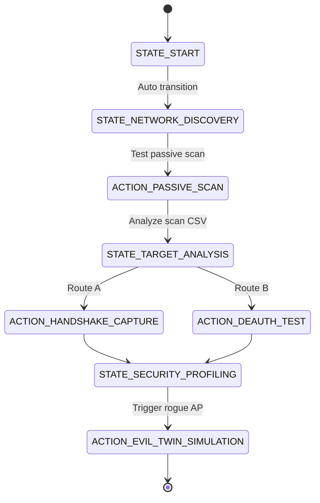

# 📈 Self-Evolving Decision Graph Engine (SEDGE) — JAMES Linux

The **Self-Evolving Decision Graph Engine (SEDGE)**, implemented in [sedge.py](file:///home/malcolm/Desktop/james-linux/james/core/sedge.py), is a reinforcement learning-inspired decision system. 

Instead of relying on hardcoded procedural scripts, SEDGE models pentesting strategies as a directed weighted graph. Over time, successful pathways are reinforced, allowing optimal scanning, analysis, and exploitation policies to emerge automatically from usage feedback.

---

## 🧭 The Decision Graph Structure

SEDGE represents decisions as a `DecisionGraph` composed of two primary elements:

### 1. Nodes (`Node`)
A node represents either a state of intelligence or a direct action:
*   **State Nodes**: Represent the agent's current understanding of the target system (e.g., `START`, `NETWORK_DISCOVERY`, `TARGET_ANALYSIS`, `SECURITY_PROFILING`).
*   **Action Nodes**: Represent active operations executed using wrappers (e.g., `PASSIVE_SCAN`, `HANDSHAKE_CAPTURE`, `DEAUTH_TEST`, `EVIL_TWIN_SIMULATION`).

### 2. Edges (`Edge`)
An edge defines a valid transition from one node to another. It contains statistics that determine transition behavior:
*   `success_weight`: Cumulative metric representing positive outcomes from traversing the edge.
*   `failure_weight`: Cumulative metric representing negative outcomes.
*   `visits`: The total count of times the agent traversed this edge.

### 📐 Utility Score Formula
The value of an edge is calculated as the ratio of success to failure, with a small epsilon (`SEDGE_EPSILON` = `1e-5`) added to prevent division by zero errors:

$$\text{Utility Score} = \frac{\text{success\_weight}}{\text{failure\_weight} + \epsilon}$$

---

## 🧠 Policy & Learning Engines

```
    ┌──────────────────────┐
    │     Current Node     │
    └──────────┬───────────┘
               │
               v
    ┌──────────────────────┐
    │    DecisionEngine    │ <── Stochastic Policy (Exploration vs. Exploitation)
    └──────────┬───────────┘
               │
               v
    ┌──────────────────────┐
    │     Chosen Step      │
    └──────────┬───────────┘
               │
               v
     [ Outcome Feedback ]
               │
               v
    ┌──────────────────────┐
    │    LearningEngine    │ <── Reinforce Weights (Success: +1.0, Failure: +1.0)
    └──────────────────────┘
```

### 1. Stochastic Selection Policy (`DecisionEngine`)
To navigate the graph, the agent utilizes a stochastic weighted policy balancing exploration (testing weak or unknown paths to gather data) and exploitation (running high-value paths to succeed).
*   **Weights Extraction**: The engine retrieves all outgoing edges from the current node and computes their utility scores.
*   **Probability Normalization**: Weights are normalized to sum to `1.0`.
*   **Uniform Fallback**: If all candidate edges have a utility score of `0.0`, the system falls back to a uniform random choice among candidates.
*   **Stochastic Choice**: The engine selects the next state using `random.choices` parameterized by these probabilities. This ensures that while successful paths are highly favored, alternative paths still have a small non-zero probability of being explored.

### 2. Backpropagation Feedback (`LearningEngine`)
When a sequence of actions completes, the operator or system triggers `feedback(outcome)`. The paths traversed during that session are reinforced:
*   `OUTCOME_SUCCESS`: Every edge in the traversed path receives `+1.0` to its `success_weight`.
*   `OUTCOME_FAILURE`: Every edge in the traversed path receives `+1.0` to its `failure_weight`.
*   `OUTCOME_PARTIAL`: Every edge receives `+0.5` to `success_weight` and `+0.5` to `failure_weight`.

---

## 📡 Case Study: Parrot WiFi Graph

The default graph built by `build_parrot_wifi_graph()` maps the standard stages of an offensive wireless campaign:



### Path Convergence Behavior
*   If **Route A** (`HANDSHAKE_CAPTURE`) consistently captures handshakes and cracks them successfully, its edge weight rises. The decision engine will increasingly select Route A.
*   If **Route B** (`DEAUTH_TEST`) fails due to active WPA3 Protected Management Frames (PMF) blocking deauth frames, its failure weight increases, causing its utility score to drop. The agent automatically shifts away from deauth tests on that network profile.
